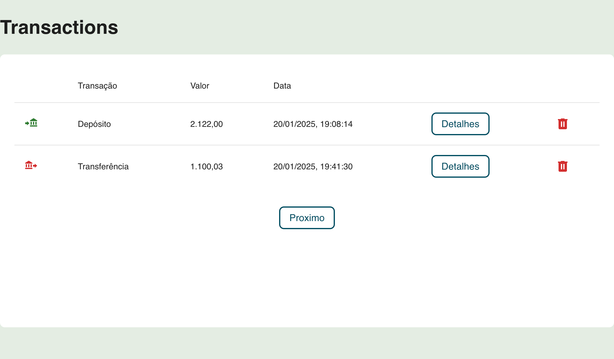

# Tech Challenge - Fase 2

## Projeto Financeiro

Projeto desenvolvido pelos alunos:

- Cristiano Santos Gonçalves - RM 358858

- Isabella Soares de Lima - RM 358599

## Sobre este projeto

Este repositório contém o projeto Transactions App e é um microfrontend remoto da aplicação. Na primeira entrega estávamos trabalhando com monorepos usando o Turborepo, porém enfrentamos diversos problemas no momento de implementar microfrontends nele, tanto usando Module Federation quando Single SPA, e por conta disso optamos por quebrar o projeto em pequenos novos repositórios e criar a comunicação entre eles utilizando **Module Federation**.

Neste projetos centralizamos todas as funcionalidades relacionadas a transações (exceto criação) e extrato da conta:

- Listagem de transações
- Edição de transações
- Deleção de transações
- Extrato da conta

Implementamos grande parte da estrutura de comunicação entre os microfrontends neste repositório. A atualização da listagem de transações é executada quando a aplicação recebe um evento customizado vindo do app root (Bank App):

```
// src/modules/extract/index.tsx

document.addEventListener(CustomEventsEnum.TRANSACTION_CREATED, () => {
    mutate();
});
```

E internamente a comunicação entre os diferentes módulos da aplicação também se dá por meio de eventos customizados:

```
document.addEventListener(CustomEventsEnum.TRANSACTION_REMOVED, () => {
    mutate();
});


document.addEventListener(CustomEventsEnum.TRANSACTION_UPDATED, () => {
    mutate();
});
```

Mais detalhes sobre decisões de projeto e requisitos da entrega podem ser encontrados [na documentação do projeto principal da aplicação](https://github.com/Desafio-Financeiro/bank-app).

## Como executar o projeto

### Via script NPM

Crie um arquivo `.env` na raiz do projeto com o conteúdo:

```
PUBLIC_BASE_URL=http://json-server-api-mu.vercel.app
```

Instale as dependências e execute o projeto:

```
npm i
npm start
```

A aplicação deve executar na url `http://localhost:3002`.



### Via Docker

Execute no terminal o comando:

```
docker compose up
```

A aplicação deve executar na url `http://localhost:3002`.

## Links para acessar as aplicações

[Bank APP](https://main.d1m6z57r6zgdud.amplifyapp.com/)

[Transactions](https://main.d12mtbag2y0zom.amplifyapp.com/)

[Reports](https://main.d3pb86cilm3vn8.amplifyapp.com/)

[Landing page](https://main.d8ml3barfxfwu.amplifyapp.com/)

[API json-server](http://json-server-api-mu.vercel.app/)

## Links para acessar os repositórios dos microfrontends

[Bank APP](https://github.com/Desafio-Financeiro/bank-app)

[Transactions](https://github.com/Desafio-Financeiro/transactions)

[Reports](https://github.com/Desafio-Financeiro/reports)

[Landing page](https://github.com/Desafio-Financeiro/landing-page)

[API json-server](https://github.com/Desafio-Financeiro/json-server-api)

[Financeiro DS](https://github.com/Desafio-Financeiro/financeiro-ds)
